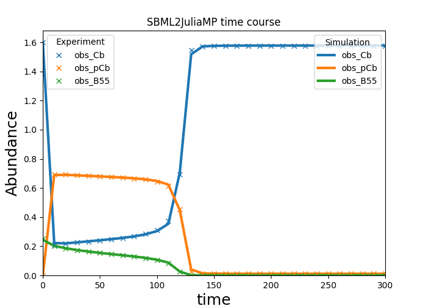

Example
=======

The `SBML2JuliaMP GitHub repository <https://github.com/paulflang/SBML2JuliaMP/tree/master/tests/fixtures>`_ contains a version of the `Vinod et Novak model <https://www.sciencedirect.com/science/article/pii/S0014579315000873>`_ of the G2/M cell cycle transition, along with simulated experimental data.

Using the Python API
--------------------

The `SBML2JuliaMP` problem can be created using the Python API (and assuming that the current working directory is the `SBML2JuliaMP` root directory) via::

	>>> import SBML2JuliaMP

	>>> problem = SBML2JuliaMP.SBML2JuliaMPProblem('examples/Vinod_FEBS2015/Vinod_FEBS2015.yaml')

and solved by::

	>>> problem.optimize()

The results are then available under ``problem.results``, which returns a dictionary containing ``'par_best'`` (the best found parameter set), ``'species'``, ``'observables'``, ``'fval'`` (the negative log-likelihood) and ``'chi2'`` (chi2 values of residuals). For example, to access the best parameter set, type::

>>> problem.results['x_best']

.. csv-table::
   :header: "Name", "par_0", "par_best", "par_best_to_par_0"
   :widths: 10, 10, 10, 10
                
 0, "kDpEnsa", 0.0500, 0.048840, 0.976807
 1, "kPhGw", 1.0000, 0.955727, 0.955727
 2, "kDpGw1", 0.2500, 0.236274, 0.945095
 3, "kDpGw2", 10.0000, 9.727009, 0.972701
 4, "kWee1", 0.0100, 0.009697, 0.969738
 5, "kWee2", 0.9900, 1.308203, 1.321418
 6, "kPhWee", 1.0000, 1.064760, 1.064760
 7, "kDpWee", 10.0000, 10.181804, 1.018180
 8, "kCdc25_1", 0.1000, 0.135812, 1.358117
 9, "kCdc25_2", 0.9000, 1.099638, 1.221820
 10, "kPhCdc25", 1.0000, 0.961436, 0.961436
 11, "kDpCdc25", 10.0000, 8.990541, 0.899054
 12, "kDipEB55", 0.0068, 0.003400, 0.500002
 13, "kAspEB55", 57.0000, 46.386552, 0.813799
 14, "fCb", 2.0000, 1.999269, 0.999634
 15, "jiWee", 0.1000, 0.199999, 1.999988
 16, "fB55_wt", 1.0000, 0.967920, 0.967920
 17, "fB55_iWee", 0.9000, 0.886548, 0.985053
 18, "fB55_Cb_low", 1.1000, 1.066191, 0.969265
 19, "fB55_pGw_weak", 1.0000, 0.971742, 0.971742
 20, "kPhEnsa_wt", 0.1000, 0.100393, 1.003933
 21, "kPhEnsa_iWee", 0.1000, 0.097819, 0.978187
 22, "kPhEnsa_Cb_low", 0.1000, 0.101325, 1.013248
 23, "kPhEnsa_pGw_weak", 0.0900, 0.090801, 1.008902

Selected observables of the optimized simulation of a given simulation condition can be plotted via::

    >>> problem.plot_results(condition='wt', observables=['obs_Cb', 'obs_pCb', 'obs_B55'])

Using the command line interface
--------------------------------

Similarly, the same example problem can be solved from the command line interface::

	user@bash:/SBML2JuliaMP$ SBML2JuliaMP optimize 'examples/Vinod_FEBS2015/Vinod_FEBS2015.yaml' -d './SBML2JuliaMP_results'

The results can be found in the output directory given to the ``-d`` argument.
